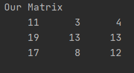
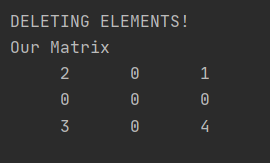
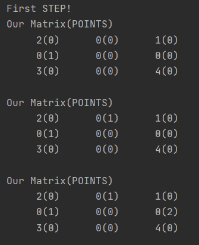
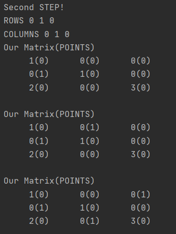
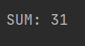

DESCRIPTION

In this practice we have to understand how hungarian algorithm works.
First of all we need to understand in which areas we have to use it.
If we speak about tasks like planning, and when we want to get the best 
result of our combination than we need bruteforce. If we have very small 
amount of data than we can try. But if we speak about large data, than it is 
the worst variant.
In this situation hungarian algorithm can help us to solve this combination's 
problem much faster compare to another variants.

But it will be better if I describe some specific example. 

**EXAMPLE**

We have some two dimensions array. And we want to find min element from each 
column but also we can choice only one element from each row too.

First Step is to find min element for each column and subtract it from each 
element of current column. Then we have to do the same with rows.
We get something like this:

Second Step is to choice zero for each column and only one in column.
But at the same time we have to take into account that for each row we have to
take only one zero. If for some column we have different variants we mast take 
into consideration aor choice for next columns.
It is possible that for some columns we cannot choice zero, because
this row is not free than we have to point this zero

In this step we have to understand which columns are used and which columns have 
collisions. If on the same row there are used zero and unused than we have to take this row.
Columns and rows form some structure of used elements, we have to find min elements
among unused and subtract it from each unused element and add to elements which are
at the intersection of used columns and rows.

After that we can repeat the previous step more one time.

Then we take elements from initial array by indexes of used zeros and add them.

 